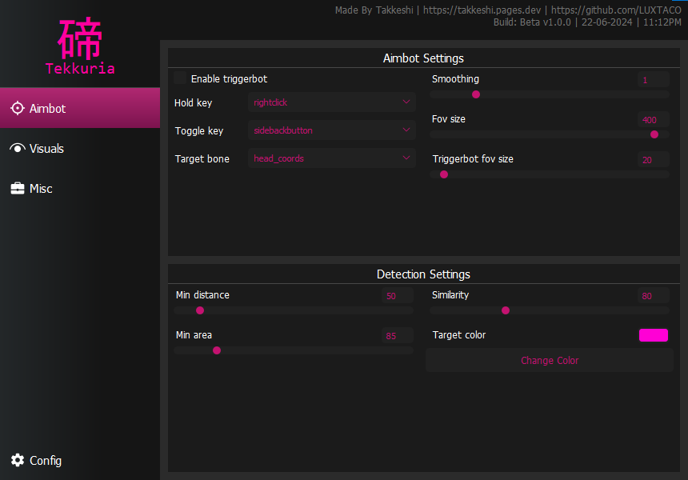

----

<p align="center">
  
</p>

----
### <p align="center">🎮 Tekkuria 🎮</p>
<br>

<p align="" >
  Before you read anything else, If you are looking for the <strong>FULL IN DEPTH</strong> explanation on how it works check out my <a href="https://youtube.com/@takkeshi_dev">channel</a> in which Ill try to upload the in depth explanation of most of my scripts!
  <br><br>
  Tekkuria is a simple yet highly customizable pixel-based aimbot designed to assist your aim efficiently. With its sleek and intuitive graphical user interface (GUI), Tekkuria stands out for its ease of use and aesthetic appeal.
</p>

<p align="center" >
  <b> >>> JOIN THE DISCORD <<< </b>
    <br>
  https://discord.gg/PdeTUZ3M62
</p>

----
### <p align="center">🧬 Installation 🧬</p>

Source

1. **Setting Up the Environment:**
   - Ensure Python is installed on your system. You can download it from [python.org](https://www.python.org/downloads/).
   - Install the required Python packages by running the following command in your terminal:
     ```sh
     pip install -r requirements.txt
     ```

2. **Configuring the Bot:**
   - Navigate to the `configs` directory in the project folder.
   - You can modify existing configuration files (e.g., `aimlabs.json`, `arsenal.json`, `badbusiness.json`) or create a new JSON configuration file for your specific needs. Refer to the structure in [`configs/config.json`](configs/config.json) as a template.
   - Configuration parameters include `targetfps`, `togglekey`, `holdkey`, and visual settings like `drawbox`, `boxsettings`, etc.
   - You can also modify them by using the GUI

3. **Running the Bot:**
   - Open a terminal or command prompt in the project directory.
   - Execute the bot by running:
     ```sh
     python main.py
     ```
   - The bot will start and use the configuration specified in `configs/config.json` by default. To use a different configuration file, modify the `main.py` to load your custom config file.

4. **Compiling to Executable (Optional):**
   - If you wish to compile the bot into a standalone executable, use the provided `start_compile_nuitka.cmd` script. This requires [Nuitka](https://nuitka.net/) to be installed.
   - Run the script by double-clicking on it or executing it from the command line:
     ```cmd
     start_compile_nuitka.cmd
     ```
   - The compiled executable will be located in the `output` directory.

Binary

1. **Download the binary from the [`Releases`](https://github.com/LUXTACO/Tekkuria-PixelBot/releases) tab**
   - Make sure to not modify the folders included in the zip
    
3. **Double click the binary and enjoy!**
   - Included binary is for windows only

<p align="center">
  
</p>

-----
### <p align="center">📦 Contribute 📦</p>
<br>

<p align="">
  Osussist is an open source project and welcomes contributions from anyone who is interested. If you want to help improve the tool, you can fork this repository and make a pull request with your changes. You can also report any issues or suggestions on the issues tab.
</p>

----

### <p align="center">📌 Disclaimer 📌</p>
<br>

<p align="">
    Please use this program only for educational purposes.
    <br><br>
    It is not meant to be used in any malicious way, and I decline any responsibility for what you do with it.
    <br><br>
    Also please learn how to use your computer before dming or making a github issue, if you ask for stuff like "whats the cheat directory" I WILL NOT help you.
</p>

---
<p align="center" >
  <b> >>> JOIN THE DISCORD <<< </b>
    <br>
  https://discord.gg/PdeTUZ3M62
</p>
